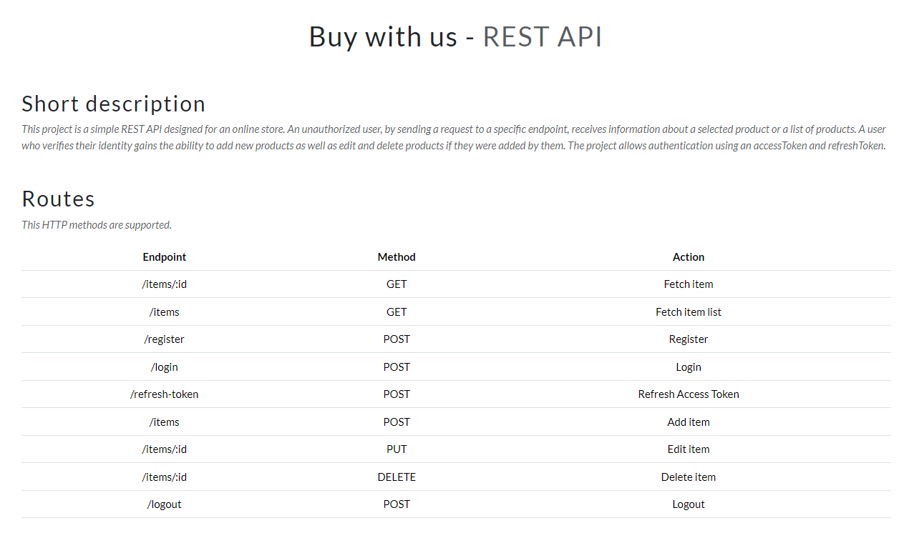
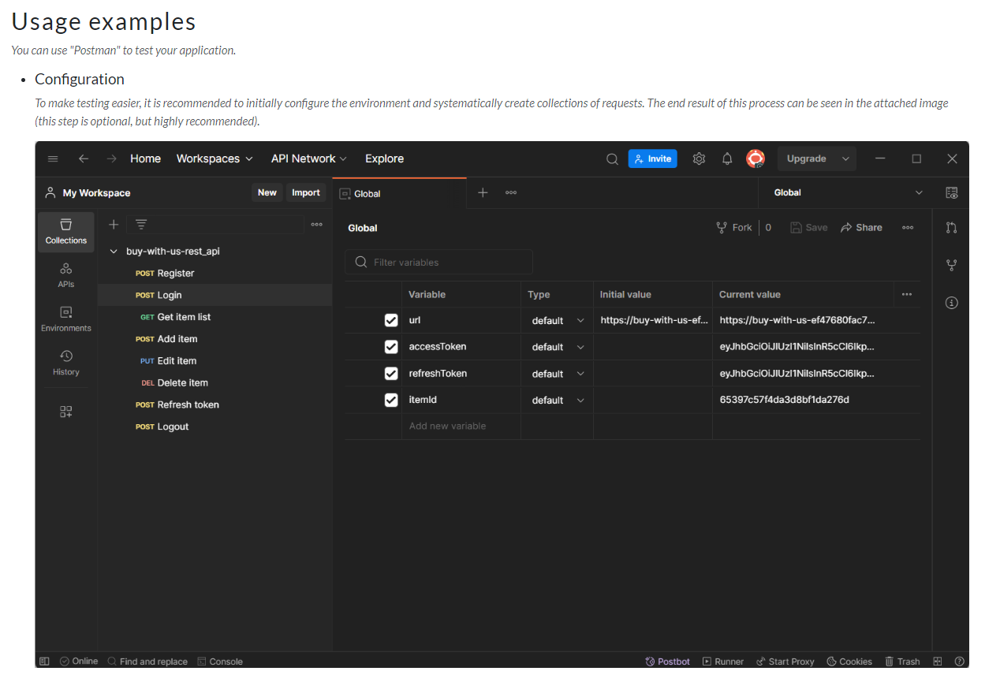

# Buy with us (REST API)


## Table of Contents
* [General Info](#general-info)
* [Website with Project](#website-with-project)
* [Tech Stack](#tech-stack)
* [Collaboration and Project Management](#collaboration-and-project-management)
* [Run Localy](#run-locally)
* [Environment Variables](#environment-variables)
* [Features](#features)
* [Used Libraries with Examples](#used-libraries-with-examples)
* [Node Technology Implementation with Examples](#node-technology-implementation-with-examples)
* [Licenses](#licenses)


## General Info
This project is a simple REST API designed for an online store. An unauthorized user, by sending a request to a specific endpoint, receives information about a selected product or a list of products.
A user who verifies their identity gains the ability to add new products as well as edit and delete products if they were added by them. The project allows authentication using an accessToken and refreshToken (JWT).


## Website with Project
```
https://buy-with-us-ef47680fac7b.herokuapp.com/
```


## Tech Stack
**Backend:** Node.js (18.16.0) with Express.js (4.18.2), hosted on Heroku

**Database:** MongoDB with Mongoose (7.6.3) 


## Collaboration and Project Management
During the project, two GitHub accounts were used to simulate group work. The main assumption of this approach was to practice sending pull requests, updating branches and resolving conflicts.


## Run Locally
Clone the project  
```bash
  git clone https://github.com/WojciechK92/buy-with-us-rest_api.git
```
Go to the project directory
```bash
  cd buy-with-us-rest_api
```
Install dependencies
```bash
  npm install
```
Start the server
```bash
  npm run watch
```


## Environment Variables
To run this project, you need to add the following environment variables to your .env file: 
- PORT
- DATABASE
- JWT_ACCESS_KEY
- JWT_REFRESH_KEY

## Features
Detailed information about the API’s functionalities, along with testing examples, can be found on the main page of the REST API.





## Used Libraries with Examples
1. Express 
- [app/app.js](https://github.com/WojciechK92/buy-with-us-rest_api/blob/01626a075f75248248330146758cb0d074393d8a/app/app.js)
- [app/routes/api.js](https://github.com/WojciechK92/buy-with-us-rest_api/blob/01626a075f75248248330146758cb0d074393d8a/app/routes/api.js)

2. Dotenv 
- [app/config.js](https://github.com/WojciechK92/buy-with-us-rest_api/blob/01626a075f75248248330146758cb0d074393d8a/app/config.js)

3. Mongoose 
- [app/db/models/user.js](https://github.com/WojciechK92/buy-with-us-rest_api/blob/01626a075f75248248330146758cb0d074393d8a/app/db/models/user.js)
- [app/db/controllers/user-controller.js](https://github.com/WojciechK92/buy-with-us-rest_api/blob/01626a075f75248248330146758cb0d074393d8a/app/controllers/user-controller.js)

4. Bcrypt 
- [app/db/models/user.js](https://github.com/WojciechK92/buy-with-us-rest_api/blob/01626a075f75248248330146758cb0d074393d8a/app/db/models/user.js)

5. JsonWebToken
- [app/middleware/auth-middleware.js](https://github.com/WojciechK92/buy-with-us-rest_api/blob/01626a075f75248248330146758cb0d074393d8a/app/middleware/auth-middleware.js)
- [app/controllers/user-controller.js](https://github.com/WojciechK92/buy-with-us-rest_api/blob/01626a075f75248248330146758cb0d074393d8a/app/controllers/user-controller.js)

6. Helmet 
- [app/app.js](https://github.com/WojciechK92/buy-with-us-rest_api/blob/01626a075f75248248330146758cb0d074393d8a/app/app.js)

7. Rate Limiter Flexible
- [app/app.js](https://github.com/WojciechK92/buy-with-us-rest_api/blob/01626a075f75248248330146758cb0d074393d8a/app/app.js)
- [app/middleware/rate-limiter-middleware.js](https://github.com/WojciechK92/buy-with-us-rest_api/blob/01626a075f75248248330146758cb0d074393d8a/app/middleware/rate-limiter-middleware.js)

8. Core module - path
- [app/controllers/page-controller.js](https://github.com/WojciechK92/buy-with-us-rest_api/blob/157cabcfbc79668e48a5e3078c810db49dbe848e/app/controllers/page-controller.js)

9. Nodemon


## Node Technology Implementation with Examples
1. Modules - commonJS and ESModules (The application was created using the commonJS) 
- [app/app.js](https://github.com/WojciechK92/buy-with-us-rest_api/blob/01626a075f75248248330146758cb0d074393d8a/app/app.js)

2. Middleware
- [app/middleware/auth-middleware.js](https://github.com/WojciechK92/buy-with-us-rest_api/blob/01626a075f75248248330146758cb0d074393d8a/app/middleware/auth-middleware.js)

3. Public folder (express.static('public'))
- [app/app.js](https://github.com/WojciechK92/buy-with-us-rest_api/blob/01626a075f75248248330146758cb0d074393d8a/app/app.js)

4. Body parsers (express.json()) 
- [app/app.js](https://github.com/WojciechK92/buy-with-us-rest_api/blob/01626a075f75248248330146758cb0d074393d8a/app/app.js)

5. Routes 
- [app/routes/api.js](https://github.com/WojciechK92/buy-with-us-rest_api/blob/01626a075f75248248330146758cb0d074393d8a/app/routes/api.js)

6. Controllers
- [app/constollers/item-controller.js](https://github.com/WojciechK92/buy-with-us-rest_api/blob/01626a075f75248248330146758cb0d074393d8a/app/controllers/item-controller.js)

7. Services 
- [app/services/generateAccessToken.js](https://github.com/WojciechK92/buy-with-us-rest_api/blob/01626a075f75248248330146758cb0d074393d8a/app/services/generateAccessToken.js)


## Licenses
1. Access to the data  
I would like to provide recruiters with free access to data in this project. Please remember that any information contained in this project is intended for recruitment purposes only and should not be used in any other way without my express consent.
